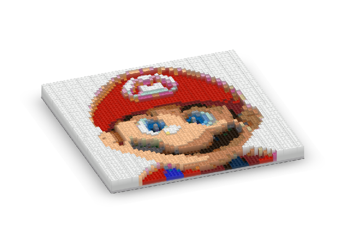

layout: true

```{r setup, include=FALSE}
packages_to_load <- c("knitr", "rmarkdown", "devtools")

for (i in packages_to_load) {
  if (!require(i, character.only = TRUE)) {
    install.packages(i)
  } else {
    library(i, character.only = TRUE)
  }
}

rm(packages_to_load)

install_github("hadley/emo")
library(emo)

options(htmltools.dir.version = FALSE)

opts_chunk$set(echo = FALSE, fig.align = "center")
```

<div class="my-footer">
  <div style="float: left;"><span>`r gsub("<br />", ", ", gsub("<br /><br />|<a.+$", "", metadata$author))`</span></div>
  <div style="float: right;"><span>`r metadata$location`, `r metadata$date`</span></div>
  <div style="text-align: center;"><span>`r gsub(".+<br />", " ", metadata$subtitle)`</span></div>
</div>

<style type="text/css">

pre {
  font-size: 10px
}
</style>

---

# About this course

.larger[
In this course you will learn how to **wrangle and explore data in R using packages from the tidyverse**. At the end of the course, you should be be familiar with the concepts of **tidy data** and the **pipe operator**, able to **import, transform, and explore** data with the tidyverse, and comfortable rewriting base R syntax in **tidyverse syntax**.
]

---

# About us

### Johannes Breuer

- senior researcher in the team Data Linking & Data Security at the GESIS Data Archive
    - main area: data linking  
    
- Ph.D. in psychology, University of Cologne  

- previously worked in several research projects investigating the use and effects of digital media (Cologne, Hohenheim, Münster, Tübingen)  

- other research interests:
    - methods of media (effects) research
    - data management
    - open science

[johannes.breuer@gesis.org](mailto:johannes.breuer@gesis.org), [@MattEagle09](https://twitter.com/MattEagle09)

---

# About us

### Stefan Müller

- senior researcher in the team Data Linking & Data Security at the GESIS Data Archive
    - main area: geo data  
    
- studied Sociology, Ethnology and Philosophy at the University of Cologne (M.A.)  

- previously worked in the area of data ingest and curator of the data repository datorium and two DFG research projects on geo data

[stefan.mueller@gesis.org](mailto:stefan.mueller@gesis.org)

---

# About you

.large[
- What's your name?  

- Where do you work?  

- What do you work on?  

- What are your experiences with R and the tidyverse?  

- What do you want to use the tidyverse for?
]

---

# Prerequisites for this course

.large[
- Working version of R and RStudio  

- Some basic knowledge of R  

- The following packages: `tidyverse`, `sf` 
]  
  
  
Install the packages with

```{r, eval = F, echo = T}
install.packages(c("tidyverse", "sf"))
```

---

# Preliminaries

.large[
- Feel free to ask questions at any time  

- We want to make this workshop as interactive as possible  

- Slides and other materials are available at
]
.center[`https://github.com/jobreu/tidyverse-workshop-gesis-2019`]

---
# Course schedule

.center[**Wednesday, May 15th, 2019**]
```{r schedule Wed, echo = F}
schedule <- data.frame(
  "When?" = c("10:00 - 11:00", "11:00 - 11:30", "11:30 - 13:00", "13:00 - 14:00", "14:00 - 15:00", "15:00 - 15:30", "15:30 - 16:30", "16:30 - 18:00", "18:00 - 20:00")
  , "What?" = c("Introduction", "<i>Coffee break</i>", "Tidy data", "<i>Lunch break</i>", "Importing data", "<i>Coffee break</i>", "Tidyverse terminology: tibbles & pipes", "Data cleaning", "<i>Wine & cheese</i>")
  , stringsAsFactors = FALSE
  , check.names = FALSE
)

kable(
  schedule
  , format = "html"
  , align = "cc"
  , escape = FALSE
)
```

---
# Course schedule

.center[**Thursday, May 16th, 2019**]
```{r schedule Thur, echo = F}
sharing_options <- data.frame(
  "When?" = c("09:00 - 10:30", "10:30 - 11:00", "11:00 - 12:00", "12:00 - 13:00", "13:00 - 14:00", "14:00 - 15:30", "15:30 - 16:00")
  , "What?" = c("Data transformation", "<i>Coffee break</i>", "Relational data", "<i>Lunch break</i>", "Data exploration I: Summary statistics", "Data exploration II: ggplot2 basics", "Outlook")
  , stringsAsFactors = FALSE
  , check.names = FALSE
)

kable(
  sharing_options
  , format = "html"
  , align = "cc"
  , escape = FALSE
)
```

---

# What to expect

.large[- This is not a statistics workshop!
    - Plumbing (skills for wrangling & exploring) instead of engineering (knowledge about stats)
```{r, out.width = "60%"}

```
- You will become a super (data) plumber who knows how to use pipes]

---
# Why do we focus on wrangling & exploring?

.large[The (in)famous **80/20-rule**: 80% wrangling, 20% analysis]  
  
  
> Given almost every data task, you’ll almost certainly need to .highlight[clean your data, visualize it, and do some exploratory data analysis] Moreover, .highlight[they are also important as you move into more advanced topics.] Do you want to start doing machine learning, artificial intelligence, and deep learning? You had better know how to clean and explore a dataset. If you can’t, you’ll basically be lost ([Sharp Sight Labs, 2017](https://www.sharpsightlabs.com/blog/first-step-data-science-top-performer/)).

---
# What we want to avoid

.center[]
<small><small>Source: https://bit.ly/2Xhz81a</small></small>


---
# What is the tidyverse?

> The tidyverse is an .highlight[opinionated collection of R packages designed for data science]. All packages share an .highlight[underlying design philosophy, grammar, and data structures] ([Tidyverse website](https://www.tidyverse.org/)).

> The tidyverse is a .highlight[coherent system of packages for data manipulation, exploration and visualization] that share a .highlight[common design philosophy] ([Rickert, 2017](https://rviews.rstudio.com/2017/06/08/what-is-the-tidyverse/)).

```{r, out.width = "25%"}
include_graphics("./pics/hex-tidyverse.png")
```

---

# Benefits of the tidyverse

.large[Most of the things we are going to show you can also be achieved with base R. However, the syntax for this is typically (more) verbose and not intuitive and, hence, difficult to learn, remember, and read (plus many tidyverse operations are faster than their base R equivalents).  
  
Tidyverse syntax is designed to increase **human-readability**. This makes it especially **attractive for R novices** as it can facilitate the experience of **self-efficacy** (see [Robinson, 2017](http://varianceexplained.org/r/teach-tidyverse/)). The tidyverse also aims for **consistency** (e.g., data frame as first argument and output) and uses **smarter defaults** (e.g., `stringsAsFactors = FALSE` & no partial matching of data frame and column names).]


---
# Workflow

.center[

]
<small><small>Source: http://r4ds.had.co.nz/</small></small>

.highlight[- **Import**: read in data in different formats (e.g., .csv, .xls, .sav, .dta)
- **Tidy**: clean data (1 row = 1 case, 1 column = 1 variable), rename & recode variables, etc.
- **Transform**: prepare data for analysis (e.g., by aggregating and/or filtering)
- **Visualize**: explore/analyze data through informative plots]
- **Model**: analyze the data by creating models (e.g, linear regression model) 
- **Communicate**: present the results (to others)

---

# Tidyverse workflow

.center[

]
<small><small>Source: http://www.storybench.org/getting-started-with-tidyverse-in-r/</small></small>

---

# Lift-off into the tidyverse `r ji("rocket")`
install all tidyverse packages<sup>1</sup>
```{r install tidyverse, eval = F, echo = T}
install.packages("tidyverse")

```
load core tidyverse packages<sup>2</sup>
.small[
```{r load tidyverse, eval = T, echo = T, message = T}
library("tidyverse")

```
]  

.footnote[
.smaller[
[1] For the full list of tidyverse packages see [https://www.tidyverse.org/packages/](https://www.tidyverse.org/packages/).  
[2] To save time and reduce namespace conflicts it often makes sense to install and load the tidyverse packages individually.
] 
]

---
# Coding in style `r ji("sunglasses")`

[The tidyverse style guide](https://style.tidyverse.org/) by Hadley Wickham  
  
[`styler`](http://styler.r-lib.org/) package (incl. RStudio add-in)

```{r install & load styler, eval = F, echo = T}
install.packages("styler")
library(styler)

```

From the package documentation:
- `style_file()` styles .R and/or .Rmd files.
- `style_dir()` styles all .R and/or .Rmd files in a directory.

```{r, out.width = "50%"}
include_graphics("./pics/styler_addin.png")
```

---

class: center, middle

# Time for `r ji("coffee")`
