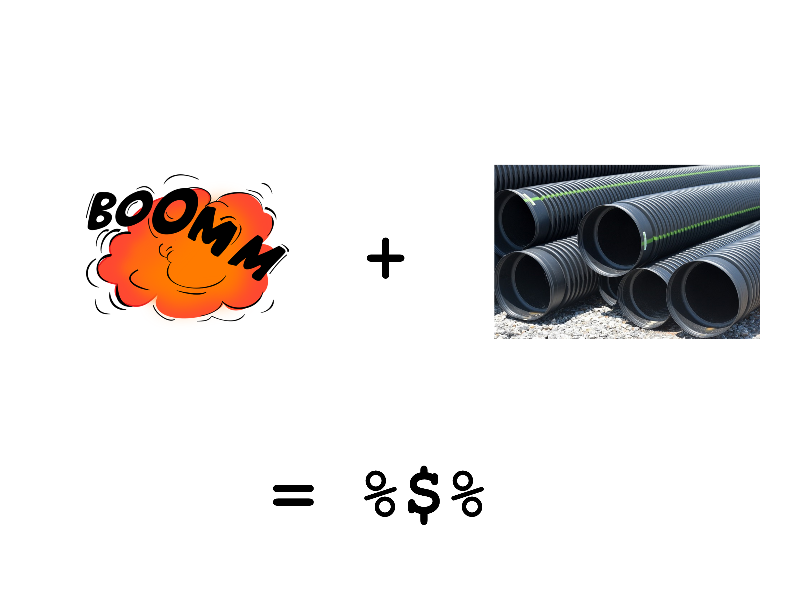

layout: true

```{r setup, include = FALSE}
if (!require(easypackages)) install.packages("easypackages")
library(easypackages)

packages("knitr", "rmarkdown", "magrittr", "readr", "tibble", "hadley/emo",
         prompt = FALSE)

options(htmltools.dir.version = FALSE)

opts_chunk$set(echo = FALSE, fig.align = "center")
```

<div class="my-footer">
  <div style="float: left;"><span>`r gsub("<br />", ", ", gsub("<br /><br />|<a.+$", "", metadata$author))`</span></div>
  <div style="float: right;"><span>`r metadata$location`, `r metadata$date`</span></div>
  <div style="text-align: center;"><span>`r gsub(".+<br />", " ", metadata$subtitle)`</span></div>
</div>

---

# The power of terminology

As you might know, in `R`, we use many different terms and concepts:

.column-left-half[

- object types, e.g.,

  - vectors
  
  - matrices
  
  - data frames
  
  - lists
  
- variables types

- etc.
]

.column-right-half[
```{r r_logic, out.width = "140%"}
include_graphics("./pics/9213.1526125966.png")
```
]

<small><small>Source: https://devopedia.org/r-data-structures </small></small>

---

# Terminology of the tidyverse

The classic concepts of `R` are not subject to this sessions.

--

But `tidyverse` adds to this a whole new set of terms and concepts that have to be clarified.

--

The good news is we're good with only three distinct concepts:

--
1. pipes

--

2. tibbles

--

3. (tribbles)

---

# What is a pipe?
```{r pipe_johannes, out.width = "40%"}
include_graphics("./pics/pipe_office_decoration.jpg")
```
.center[<small><small>Source: Johannes' office </small></small>]

--

You might know them from other scripting utilities 
- e.g., `bash` where a `|` operator is used

---

# Nested functions in base `R`
First, let's load some data:

--

```{r read_mtcars, echo = TRUE, message = FALSE}
mtcars <- read_csv(readr_example("mtcars.csv"))
```

--

Say, if we want to calculate the mean value of the variable `mpg`, as smart people we can use this command:

--

```{r read_mtcars_mpg, echo = TRUE, message = FALSE}
mean(read_csv(readr_example("mtcars.csv"))$mpg)
```

--

Pretty, isn't it? Well...

---

# Make it prettier with base `R`
We can use indentions to alleviate issues with readability:

--

```{r read_mtcars_mpg_intend, echo = TRUE, message = FALSE}
mean(
  read_csv(
    readr_example("mtcars.csv")
    )$mpg
  )
```

--

This works. But it also has some flaws:

--
- Don't you dare to forget closing a bracket

--

- It's not easy to grasp which operation is the most important one

--
  - Is it loading the data?
  
--
  - Is it choosing the proper variable?
  
--
  - Or the calculation of the mean value?

---

# Disentangling commands
An easy way would be:

--

```{r read_mtcars_mpg_disentangled_1, echo = TRUE, message = FALSE}

file_string         <- "mtcars.csv"
example_file        <- readr_example(file_string)
example_file_loaded <- read_csv(example_file)
mean(example_file_loaded$mpg)
```

--

Or, to prevent the creation of too many separate objects:

--

```{r read_mtcars_mpg_disentangled_2, echo = TRUE, message = FALSE}

tmp_object          <- "mtcars.csv"
tmp_object          <- readr_example(tmp_object)
example_file_loaded <- read_csv(tmp_object)
mean(example_file_loaded$mpg)
```

--

Of course, you can mix these approaches to your liking...

---

# Pipes as a solution?
Pipes disentangle the whole process with an alternative approach by applying any involved function step by step:

--

```{r read_mtcars_mpg_pipe, echo = TRUE, message = FALSE}
"mtcars.csv" %>% 
  readr_example() %>% 
  read_csv() %>% 
  .$mpg %>% 
  mean()
```

--

Most importantly, the central dataset is now on top and the starting point of everything.

---

# Formal definition of pipes: basic logic

Usually, in `R` we apply functions as follows:

```{r function_r, echo = TRUE, eval = FALSE}
f(x)
```

--

In the logic of pipes this function is written as:

```{r function_pipe, echo = TRUE, eval = FALSE}
x %>% f()
```

--

Thus, the inner argument/object is placed before the actual function call.

---

# Formal definition of pipes: first argument

In cases of multiple arguments, `x` is always the first argument of the function.

--

Base R:

```{r function_r_arguments, echo = TRUE, eval = FALSE}
f(x, y)
```

--

.center[vs.]

Piping:

```{r function_pipe_arguments, echo = TRUE, eval = FALSE}
x %>% f(y)
```

---

# Formal definition of pipes: `.` as placeholder

Previously, we learned that `x` always refers to the first argument. We can also make this explicit:

```{r formal_pipe, echo = TRUE, eval = FALSE}
x %>% f(., y)
```

This is useful in cases in which `x` does not refer to the first argument:

```{r formal_pipe_argument, echo = TRUE, eval = FALSE}
x %>% f(y, z = .)
```

---

# Notes on pipes' styling: indentions

We can write pipes in one line:

--

```{r pipe_row, echo = TRUE, eval = FALSE}
u %>% v %>% w %>% x %>% y %>% z
```

--

Yet, this destroys the readability. At least for pipes with more than one `%>%` using multiple lines is easier to read:

--

```{r pipe_line, echo = TRUE, eval = FALSE}
u %>% 
  v %>% 
  w %>% 
  x %>% 
  y %>% 
  z
```

---

# Notes on pipes' styling: nesting

As pipes are so convenient you may be tempted to nest operations within pipes and to merge separate processes. For example:

--

```{r pipe_nested, echo = TRUE, eval = FALSE}
obj_1 <- 
  u %>% 
  v %>% 
  w

z %>% 
  f(obj1, x) %>% 
  y
```

---

# Notes on pipes' styling: nesting
To:

```{r pipe_nested_2, echo = TRUE, eval = FALSE}
z %>% 
  f(
    u %>% 
      v %>% 
      w, 
    x
  ) %>% 
  y
```

--

While this is cool, it can get cumbersome to read.

--
- It may be better to keep the processes split up in pipes with more than one `%>%` operator 

--

- Hadley Wickham recommends to never use more than ten `%>%` anyway: https://r4ds.had.co.nz/pipes.html#when-not-to-use-the-pipe


---

# Don't overthink pipes

.column-left-half[
Pipes are so nice, you may be tempted to use them all the time.

Some of you may even spend hours to create one single data preparation workflow in one single pipe.

This is awesome. However, it's not very efficient and also misses the whole purpose of applying pipes which are:

- readability

- reproducibility
]

.column-right-half[
```{r crazy_pipes, out.width = "100%"}
include_graphics("./pics/crazy_pipes.png")
```
]

---

# Alternative pipe operators and related tools from `magrittr`

- t(ee)-pipes: `%T>%`

- exploding-pipes: `%$%`

- ...

- \{\} brackets


---

# t-pipes
```{r mr_t_pipe, out.width = "100%"}
include_graphics("./pics/mr_t_pipes.png")
```

<!--   -->
<!-- https://upload.wikimedia.org/wikipedia/commons/8/83/Mr._T_HS_Yearbook.jpg -->
<!-- https://pixabay.com/photos/drainage-pipes-construction-site-2471293/ -->

---

# t-pipes

t-Pipes create some kind of a loophole during a piping process.

They pause the current relationship between previous commands and the current one.

Moreover, they stop the inheritance of the output of the current command.

**t-Pipes can create intermediate results** such as

- plots

- tables

... and continue where we left the main pipe


---

# t-pipes

```{r t_pipe_plot, echo = TRUE, message = FALSE, fig.height = 4}
"mtcars.csv" %>% 
  readr_example() %>% 
  read_csv() %>% 
  .$mpg %T>% 
  plot() %>% # an intermediate plot
  mean()
```


---

# Exploding pipes 

```{r exploding_pic, out.width = "100%"}

``` 

<!-- https://pixabay.com/vectors/explosion-detonation-blast-burst-147909/-->
<!-- https://pixabay.com/photos/drainage-pipes-construction-site-2471293/ -->


---

# Exploding pipes

```{r exploding_1, echo = TRUE, message = FALSE, eval = FALSE, fig.height = 4}
"mtcars.csv" %>% 
  readr_example() %>% 
  read_csv() %>%
  cor(.$disp, .$mpg)
```

This produces an error because piping always expects complete objects, such as data frames, and not single vectors.

```{r exploding_2, echo = TRUE, message = FALSE, eval = TRUE, fig.height = 4}
"mtcars.csv" %>% 
  readr_example() %>% 
  read_csv() %$% # 'exploding'
  cor(disp, mpg)
```

---

# `{}`-brackets

Another workaround for this problem is the use of curly brackets.

They prevent the first argument to be `.`

```{r curly_brackets, echo = TRUE, message = FALSE, eval = TRUE, fig.height = 4}
"mtcars.csv" %>% 
  readr_example() %>% 
  read_csv() %>% 
  { cor(.$disp, .$mpg) }
```

They are what you may know as *lambda-functions* from other languages.

---

# What's left?

tidyverse pipes are only one implementation of pipes in R.

They are based on the implementation of the `magrittr` package.

Other implementations, not discussed here, include:

- assignment pipes `%<>%` as an alternative to `<-`

- `pipeR`'s `%>>%` pipes

---

# tibbles

Tibbles are the data format used in the `tidyverse`.

They are basically standard `R data.frame()`s, enriched with some more features and metadata:

- information about size (rows x columns) of dataframes

- information about variable types

- better readability
  - they fit the screen automatically
  
- no strings as factors by default

---

# This is how they look

```{r tibble_example, echo = FALSE, message = FALSE, eval = TRUE}
example_tibble <- read_csv("../../data/titanic/titanic.csv")
example_tibble
```


---

# How to use tibbles?

.middle[
Usually, we don't have to do anything. 

tibbles are the standard output format of all tidyverse applications.

Yet, some old (or non-compliant) `R` functions may have some issues with tibbles. 

Luckily, we just can use `as.data.frame(your_tibble)` on them. Problem solved.
]

---

# Creating tibbles

Occasionally, we want to create `tibbles` from standard `data.frames`.

This can be done with the `tibble()`-function from the `tibble`-package.

```{r tibble-pic, out.width = "35%"}
include_graphics("./pics/tibble.png")
``` 

---

# Loading a standard `data.frame`

```{r standard-data-frame, echo = TRUE, message = FALSE, eval = TRUE}
titanic_df <- read.csv2("../../data/titanic/titanic.csv", sep = ",")
titanic_df
```

---

# Converting to a tibble

```{r convert-to-tibble, echo = TRUE, message = FALSE, eval = TRUE}
titanic_tibble <- 
  titanic_df %>% 
  as_tibble()

titanic_tibble
```

---

# Creating tibbles from scratch

Similar to creating `base R data.frames`, we can also create `tibbles` without any previous data input.

```{r from-scratch-tibble, echo = TRUE, message = FALSE, eval = TRUE}
tibble(
  a = 1:5,
  b = 20:16,
  c = letters[1:10] %>% 
    sample(., size = 5)
)
```

---

# tribbles

Using the `tribble`-approach, is a convenient way to create `tibbles` for small tables as it resembles the final layout of the dataframe.

```{r tribble, echo = TRUE, message = FALSE, eval = TRUE}
tribble(
  ~a, ~b, ~c,
  1,  20,  "h",
  2,  19,  "j",
  3,  18,  "g",
  4,  17,  "i",
  5,  16,  "c"
)
```

---

# Summary

For now, we should be familiar with two concepts for out further exploration of the `tidyverse`:

1. pipes
  - they disentangle the process of data wrangling in simple chunks
  
  - denoted by the operator `%>%` (yet there are alternatives we should be aware of)
  
2. tibbles
  - an easy to read and modern format for datasets in `R`
  
  - the standard data format of the `tidyverse`

---

class: center, middle

# [Exercise](https://jobreu.github.io/tidyverse-workshop-gesis-2019/exercises/A2_Terminology_exercises_question.html) time `r ji("weight_lifting_woman")``r ji("muscle")``r ji("running_man")``r ji("biking_man")`

## [Solutions](https://jobreu.github.io/tidyverse-workshop-gesis-2019/solutions/A2_Terminology_exercises_solution.html)