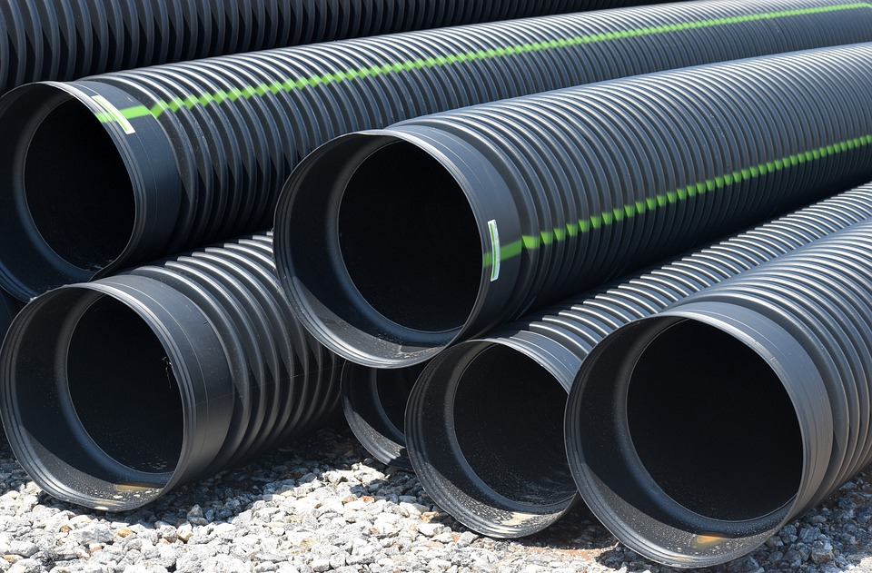

layout: true

```{r setup, include = FALSE}
packages_to_load <- c("knitr", "rmarkdown", "magrittr", "readr")

for (i in packages_to_load) {
  if (!require(i, character.only = TRUE)) {
    install.packages(i)
  } else {
    library(i, character.only = TRUE)
  }
}

rm(packages_to_load)

options(htmltools.dir.version = FALSE)

opts_chunk$set(echo = FALSE, fig.align = "center")
```

<div class="my-footer">
  <div style="float: left;"><span>`r gsub("<br />", " & ", gsub("<br /><br />|<a.+$", "", metadata$author))`</span></div>
  <div style="float: right;"><span>`r metadata$location`, `r metadata$date`</span></div>
  <div style="text-align: center;"><span>`r gsub(".+<br />", " ", metadata$title)`</span></div>
</div>


---
# The Power of Terminology
It's maybe common sense to know what other people are talking about.

It's not just words, it's the understanding of them.

As you might know, R contains some many terms and concepts

- object types
- variables types
- function definitions
- etc.

tidyverse adds to this a whole new set of terms that have to be clarified


---
# Pipes and Tibbles 
.large[
.center[
In this session, we will learn about pipes and tibbles.

They are one of the most important terms in the whole uni.. 

tidyverse.
]
]


---
# What is a pipe?
```{r, out.width = "60%"}
include_graphics("pipe office decoration.jpg")
```

You might know them from other scripting utilities such as `bash` (here a `|` operator is used).


---
# Nested Functions in Base R
First, let's load some data:

```{r echo = TRUE, message = FALSE}
mtcars <- read_csv(readr_example("mtcars.csv"))
```

Say, if we aim to calculate the mean value of the variable `mpg` variable, as smart people we can fire up this command:

```{r echo = TRUE, message = FALSE}
mean(read_csv(readr_example("mtcars.csv"))$mpg)
```

Pretty, isn't it? Well...


---
# Make it Prettier with Base R
We can use indentions to workaround issues with readablity:

```{r echo = TRUE, message = FALSE}
mean(
  read_csv(
    readr_example("mtcars.csv")
    )$mpg
  )
```

This works. But it also has some serious flaws:

- Don't you dare to forget closing a bracket
- It's not easy to grasp which operation is the most important one


---
# Disentangling and Overwriting
An easy way is this:

```{r echo = TRUE, message = FALSE}

file_string         <- "mtcars.csv"
example_file        <- readr_example(file_string)
example_file_loaded <- read_csv(example_file)
mean(example_file_loaded$mpg)
```

Or, to prevent creating too many separate objects:

```{r echo = TRUE, message = FALSE}

tmp_object          <- "mtcars.csv"
tmp_object          <- readr_example(tmp_object)
example_file_loaded <- read_csv(tmp_object)
mean(example_file_loaded$mpg)
```

Mix to your liking...


---
# Pipes as solution?
Pipes disentangle the whole process in a whole other way and apply each involved function step by step:

```{r echo = TRUE, message = FALSE}
"mtcars.csv" %>% 
  readr_example() %>% 
  read_csv() %>% 
  .$mpg %>% 
  mean()
```

Most importantly, the central dataset is now on top and the starting point of everything.


---
# Formal Defintion of Pipes: Basic Logic

Usually, in `R` we apply functions as follows:

```{r echo = TRUE, eval = FALSE}
f(x)
```

In the logic of pipes this function is written as:

```{r echo = TRUE, eval = FALSE}
x %>% f()
```

Thus, the inner argument/object is placed before the actual function call.


---
# Formal Defintion of Pipes: First Argument

In cases of multiple arguments `x` is always the first argument of the function.

Base R:

```{r echo = TRUE, eval = FALSE}
f(x, y)
```

Piping:

```{r echo = TRUE, eval = FALSE}
x %>% f(y)
```


---
# Formal Defintion of Pipes: . as Placeholder

Previously, we learned that `x` always refers to the first argument. We can also make this explicit:

```{r echo = TRUE, eval = FALSE}
x %>% f(., y)
```

This is useful in case, where `x` does not refer to the first argument:

```{r echo = TRUE, eval = FALSE}
x %>% f(y, z = .)
```


---
# Notes on Pipes' Styling: Indentions

We can write pipes within one line:

```{r echo = TRUE, eval = FALSE}
u %>% v %>% w %>% x %>% y %>% z
```

Yet, this destroys the readability. At least for pipes with more than one `%>%` using multiple lines is easier to read:

```{r echo = TRUE, eval = FALSE}
u %>% 
  v %>% 
  w %>% 
  x %>% 
  y %>% 
  z
```


---
# Notes on Pipes' Styling: Nesting I

As pipes are so convenient you may the tempted to nest operations within pipes and to merge to separate processes, for example:

```{r echo = TRUE, eval = FALSE}
obj_1 <- 
  u %>% 
  v %>% 
  w

z %>% 
  f(obj1, x) %>% 
  y
```


---
# Notes on Pipes' Styling: Nesting II
To:

```{r echo = TRUE, eval = FALSE}
z %>% 
  f(
    u %>% 
      v %>% 
      w, 
    x
  ) %>% 
  y
```

While this is cool, it can get cumbersome ro read

- It may be better to let the processes split up in pipes with more than one `%>%` operator 
- Hadley Wickham himself^{TM} recommends never to use more than ten `%>%` anyway 


---
# Don't Overthink Pipes
.column-left-half[
Pipes are so nice, you may be tempted to use them all the time.

Some of you may even spend hours to create one single data preparation workflow in one single pipe.

While this is cool, it may not be very sufficient and also misses the whole purpose of applying pipes

- readability
- reproducibility
- and stuff
]

.column-right-half[
```{r, out.width = "100%"}
include_graphics("./crazy_pipes.png")
```
]


---
# Alternative Pipe Operators and Related Tools from `magrittr`

- t(ee)-pipes: `%T>%`
- exploding-pipes: `%$%`
- ...
- \{\} brackets


---
# t-Pipes
```{r, out.width = "100%"}
include_graphics("./mr_t_pipes.png")
```

<!--   -->
<!-- https://upload.wikimedia.org/wikipedia/commons/8/83/Mr._T_HS_Yearbook.jpg -->
<!-- https://pixabay.com/photos/drainage-pipes-construction-site-2471293/ -->

---
# t-Pipes

t-Pipes create some kind of a loophole during a piping process.

They pause the current relationship between previous commands and the current one.

Moreover, they stop the inheritance of the output of the current command.

**t-Pipes can create intermediate results** such as

- plots
- tables

... and continue where we left the main pipe


---
# t-Pipes
```{r echo = TRUE, message = FALSE, fig.height = 4}
"mtcars.csv" %>% 
  readr_example() %>% 
  read_csv() %>% 
  .$mpg %T>% 
  plot() %>% # an intermediate plot
  mean()
```


---
# Exploding Pipes 
```{r, out.width = "100%"}
include_graphics("./exploding_pipes.png")
``` 

<!-- https://pixabay.com/vectors/explosion-detonation-blast-burst-147909/-->
<!-- https://pixabay.com/photos/drainage-pipes-construction-site-2471293/ -->


---
# Exploding Pipes
```{r echo = TRUE, message = FALSE, eval = FALSE, fig.height = 4}
"mtcars.csv" %>% 
  readr_example() %>% 
  read_csv() %>%
  cor(.$disp, .$mpg)
```

This produces an error because piping always expects whole objects, such as data frames, and no single vectors.

```{r echo = TRUE, message = FALSE, eval = TRUE, fig.height = 4}
"mtcars.csv" %>% 
  readr_example() %>% 
  read_csv() %$% # 'exploding'
  cor(disp, mpg)
```


---
# `{}` Brackets

Another workaround for our problem are curly brackets.

They prevent the first argument to be `.`

```{r echo = TRUE, message = FALSE, eval = TRUE, fig.height = 4}
"mtcars.csv" %>% 
  readr_example() %>% 
  read_csv() %>% 
  { cor(.$disp, .$mpg) }
```

They are what you may know from other languages being called lamda-functions.


---
# What's left?
tidyverse pipes are only one implementation of pipes in R.

They are based on the implementation of the `magrittr` package.

Other implementations, not discussed here, would be:

- assignment pipes `%<>%`as an alternative to `<-`
- `pipeR`'s `%>>%` pipes


---
# tibbles
Tibbles are the data format used in the tidyverse.

They are basically standard `R data.frame()`s, enriched with some more features and metadata:

- information about size (rows x columns) of data
- information about variable types
- better readability
  - they fit to the screen automatically


---
# You've seen them already...
```{r echo = FALSE, message = FALSE, eval = TRUE}
example_tibble <- read_csv("../../data/titanic/titanic.csv")
example_tibble
```


---
# How to use tibbles?
Usually we don't have to do anything. 

tibbles are the standard output format of all tidyverse applications.

Yet, some old R functions may have some issues with tibbles. Luckily, we just can use `as.data.frame(your_tibble)` on them. Problem solved.


