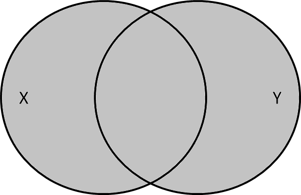
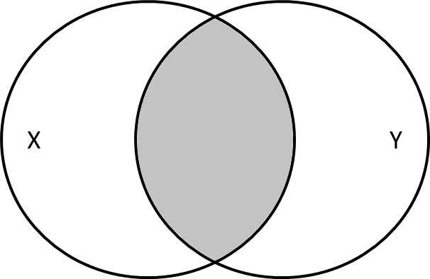
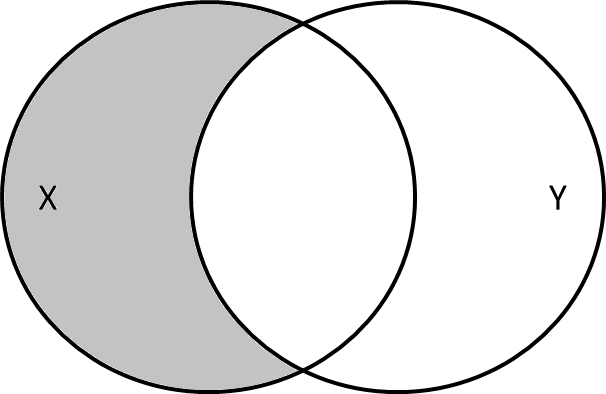

layout: true

```{r setup, include=FALSE}
packages_to_load <- c("knitr",
                      "rmarkdown",
                      "devtools",
                      "tibble",
                      "readr",
                      "kableExtra",
                      "dplyr",
                      "stringr")

for (i in packages_to_load) {
  if (!require(i, character.only = TRUE)) {
    install.packages(i)
  } else {
    library(i, character.only = TRUE)
  }
}

rm(packages_to_load)

install_github("hadley/emo")
library(emo)

options(htmltools.dir.version = FALSE)

opts_chunk$set(echo = FALSE, fig.align = "center")
```

<div class="my-footer">
  <div style="float: left;"><span>`r gsub("<br />", ", ", gsub("<br /><br />|<a.+$", "", metadata$author))`</span></div>
  <div style="float: right;"><span>`r metadata$location`, `r metadata$date`</span></div>
  <div style="text-align: center;"><span>`r gsub(".+<br />", " ", metadata$subtitle)`</span></div>
</div>

---

# Combining datasets

In most cases researchers/analysts work with more than one data file.  

The simplest way two combine tabular datasets is to use `bind_cols()` or `bind_rows()` from `dplyr`.  
  
However, to use **`bind_cols()`**, you need to make sure that the datasets contain the **same cases** (rows) in the **same order**. In order to use **`bind_rows()`**, it is necessary to have the **same variables** (with the same names) across the datasets.

`dplyr` offers three categories of so-called *two-table verbs* to combine two tabular datasets:

1. Mutating joins  

2. Filtering joins  

3. Set operations

---

# Superhero data `r ji("bat")``r ji("zap")``r ji("spider_web")``r ji("merman")`

- to illustrate the different joins from `dlpyr` we will use data from the Super Heroes dataset from [*Kaggle*](https://www.kaggle.com/claudiodavi/superhero-set)

```{r superhero data, include = F}
heroes <- read_csv("../../data/other/heroes_information.csv") %>% 
  select(name, Alignment, Race, Publisher) %>% 
  rename(Name = name) %>%
  mutate(Publisher = str_replace(Publisher, " Comics", "")) %>%
    filter(
    (Name == "Batgirl" & Race != "-") |
      Name == "Aquaman" |
      Name == "Catwoman" |
      Name == "Magneto" |
      Name == "Deadpool" |
      Name == "Poison Ivy" |
      Name == "Hellboy"
  )

publishers <- read_csv("../../data/other/heroes_information.csv") %>% 
  select(Publisher) %>%
  distinct() %>% 
  filter(
    Publisher == "Marvel Comics" |
    Publisher == "DC Comics" |
    Publisher == "Image Comics"
  ) %>% 
  distinct() %>%
  mutate(Publisher = str_replace(Publisher, " Comics", ""),
    Founded = case_when(
    Publisher == "Marvel" ~ 1939L,
    Publisher == "DC" ~ 1934L,
    Publisher == "Image" ~ 1992L
  ),
  Location = case_when(
    Publisher == "Marvel" ~ "NYC (NY)",
    Publisher == "DC" ~ "Burbank (CA)",
    Publisher == "Image" ~ "Berkeley (CA)"
  ))


```

.pull-left[
.center[
**Superheroes**
```{r superhero table, echo = FALSE}
heroes %>%
  kable("html") %>% 
  kable_styling(font_size = 16)
```
]
]

.pull-right[
.center[
**Publishers**
```{r publishers table, echo = FALSE}
publishers %>%
  kable("html") %>% 
  kable_styling(font_size = 16)
```
]
]

---

# Mutating joins

.large[
> A mutating join [...] .highlight[first matches observations by their keys], then .highlight[copies across variables from one table to the other] ([R for Data Science](https://r4ds.had.co.nz/relational-data.html#mutating-joins)).

- `inner_join()`  

- `left_join()`  

- `right_join()`  

- `full_join()`
]

---

# Inner join

 > All rows from `x` where there are matching values in `y`, and all columns from `x` and `y`.

.center[]

.small[
Animation by [Garrick Aden-Buie](https://github.com/gadenbuie/tidyexplain)
]

---

# Inner join example

.pull-left[
.center[
```{r superhero table 2, echo = FALSE}
heroes %>%
  kable("html") %>% 
  kable_styling(font_size = 10)
```
]
]

.pull-right[
.center[
```{r publishers table 2, echo = FALSE}
publishers %>%
  kable("html") %>% 
  kable_styling(font_size = 10)
```
]
]
<br>
```{r eval = F, echo = T}
heroes %>% 
  inner_join(publishers, by = "Publisher")
```

```{r inner join, echo = F}
heroes %>% 
  inner_join(publishers, by = "Publisher") %>%
  kable("html") %>% 
  kable_styling(font_size = 10)
```

---

# Left join

> All rows from `x`, and all columns from `x` and `y`. Rows in `x` with no match in `y` will have `NA` values in the new columns.

.center[]

.small[
Animation by [Garrick Aden-Buie](https://github.com/gadenbuie/tidyexplain)
]

---

# Left join example

.pull-left[
.center[
```{r superhero table 3, echo = FALSE}
heroes %>%
  kable("html") %>% 
  kable_styling(font_size = 10)
```
]
]

.pull-right[
.center[
```{r publishers table 3, echo = FALSE}
publishers %>%
  kable("html") %>% 
  kable_styling(font_size = 10)
```
]
]
<br>
```{r eval = F, echo = T}
heroes %>% 
  left_join(publishers, by = "Publisher")
```

```{r left join, echo = F}
heroes %>% 
  left_join(publishers, by = "Publisher") %>%
  kable("html") %>% 
  kable_styling(font_size = 10)
```

---

# Right join

> All rows from y, and all columns from `x` and `y`. Rows in `y` with no match in `x` will have `NA` values in the new columns.

.center[]

.small[
Animation by [Garrick Aden-Buie](https://github.com/gadenbuie/tidyexplain)
]

---

# Right join example

.pull-left[
.center[
```{r superhero table 4, echo = FALSE}
heroes %>%
  kable("html") %>% 
  kable_styling(font_size = 10)
```
]
]

.pull-right[
.center[
```{r publishers table 4, echo = FALSE}
publishers %>%
  kable("html") %>% 
  kable_styling(font_size = 10)
```
]
]
<br>
```{r eval = F, echo = T}
heroes %>% 
  right_join(publishers, by = "Publisher")
```

```{r right join, echo = F}
heroes %>% 
  right_join(publishers, by = "Publisher") %>%
  kable("html") %>% 
  kable_styling(font_size = 10)
```

---

# Full join

> All rows and all columns from both `x` and `y`. Where there are not matching values, returns `NA` for the one missing.

.center[]

.small[
Animation by [Garrick Aden-Buie](https://github.com/gadenbuie/tidyexplain)
]

---

# Full join example

.pull-left[
.center[
```{r superhero table 5, echo = FALSE}
heroes %>%
  kable("html") %>% 
  kable_styling(font_size = 10)
```
]
]

.pull-right[
.center[
```{r publishers table 5, echo = FALSE}
publishers %>%
  kable("html") %>% 
  kable_styling(font_size = 10)
```
]
]
<br>
```{r eval = F, echo = T}
heroes %>% 
  full_join(publishers, by = "Publisher")
```

```{r full join, echo = F}
heroes %>% 
  full_join(publishers, by = "Publisher") %>%
  kable("html") %>% 
  kable_styling(font_size = 9)
```

---

# Filtering joins

.large[
> Filtering joins .highlight[match observations in the same way as mutating joins], but .highlight[affect the observations, not the variables] ([R for Data Science](https://r4ds.had.co.nz/relational-data.html#filtering-joins)).

- `semi_join()`  

- `anti_join()`
]

---

# Semi join

> All rows from `x` where there are matching values in `y`, keeping just columns from `x`.

.center[]

.small[
Animation by [Garrick Aden-Buie](https://github.com/gadenbuie/tidyexplain)
]

---

# Semi join example

.pull-left[
.center[
```{r superhero table 6, echo = FALSE}
heroes %>%
  kable("html") %>% 
  kable_styling(font_size = 10)
```
]
]

.pull-right[
.center[
```{r publishers table 6, echo = FALSE}
publishers %>%
  kable("html") %>% 
  kable_styling(font_size = 10)
```
]
]
<br>
```{r eval = F, echo = T}
heroes %>% 
  semi_join(publishers, by = "Publisher")
```

```{r semi join, echo = F}
heroes %>% 
  semi_join(publishers, by = "Publisher") %>%
  kable("html") %>% 
  kable_styling(font_size = 10)
```

---

# Anti join

> All rows from `x` where there are not matching values in `y`, keeping just columns from `x`.

.center[]

.small[
Animation by [Garrick Aden-Buie](https://github.com/gadenbuie/tidyexplain)
]

---

# Anti join example

.pull-left[
.center[
```{r superhero table 7, echo = FALSE}
heroes %>%
  kable("html") %>% 
  kable_styling(font_size = 10)
```
]
]

.pull-right[
.center[
```{r publishers table 7, echo = FALSE}
publishers %>%
  kable("html") %>% 
  kable_styling(font_size = 10)
```
]
]
<br>
```{r eval = F, echo = T}
heroes %>% 
  anti_join(publishers, by = "Publisher")
```

```{r anti join, echo = F}
heroes %>% 
  anti_join(publishers, by = "Publisher") %>%
  kable("html") %>% 
  kable_styling(font_size = 10)
```

---

# Set operations

.large[
> These operations .highlight[work with a complete row, comparing the values of every variable]. These .highlight[expect the x and y inputs to have the same variables], and treat the observations like sets ([R for Data Science](https://r4ds.had.co.nz/relational-data.html#set-operations)).

- `union()`  

- `union_all()` 

- `intersect()` 

- `setdiff()`
]

---

# Union

> All unique rows from `x` and `y`.

.pull-left[
.center[]
.small[Animation by [Garrick Aden-Buie](https://github.com/gadenbuie/tidyexplain)]
]

.pull-right[
.center[
`union(x, y)`  


]
]

---

# Union all

> All rows from `x` and `y`, keeping duplicates.

.center[]

.small[
Animation by [Garrick Aden-Buie](https://github.com/gadenbuie/tidyexplain)
]

---

# Intersection

> Common rows in both `x` and `y`, keeping just unique rows.

.pull-left[
.center[]
.small[Animation by [Garrick Aden-Buie](https://github.com/gadenbuie/tidyexplain)]
]

.pull-right[
.center[
`intersect(x, y)`  


]
]

---

# Set difference

> All rows from `x` which are not also rows in `y`, keeping just unique rows.

.pull-left[
.center[]
.small[Animation by [Garrick Aden-Buie](https://github.com/gadenbuie/tidyexplain)]
]

.pull-right[
.center[
`setdiff(x, y)`  


]
]

---

class: center, middle

# [Exercise](https://github.com/jobreu/tidyverse-workshop-gesis-2019/blob/master/exercises/B2_RelationalData_exercises_question.html) time `r ji("weight_lifting_woman")``r ji("muscle")``r ji("running_man")``r ji("biking_man")`

## [Solutions](https://github.com/jobreu/tidyverse-workshop-gesis-2019/blob/master/solutions/B2_RelationalData_exercises_solution.html)